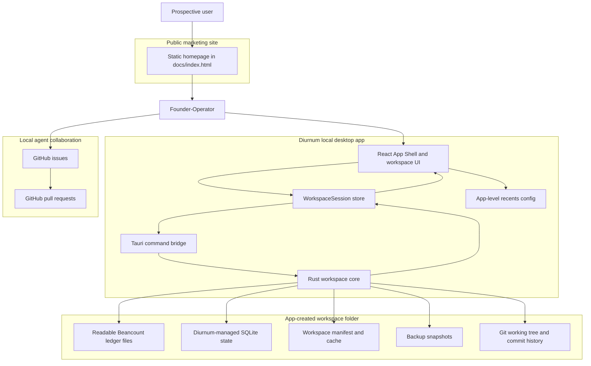
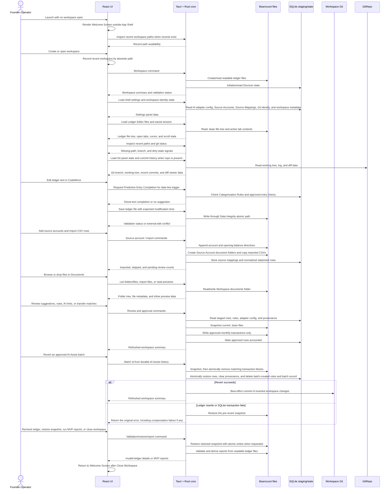
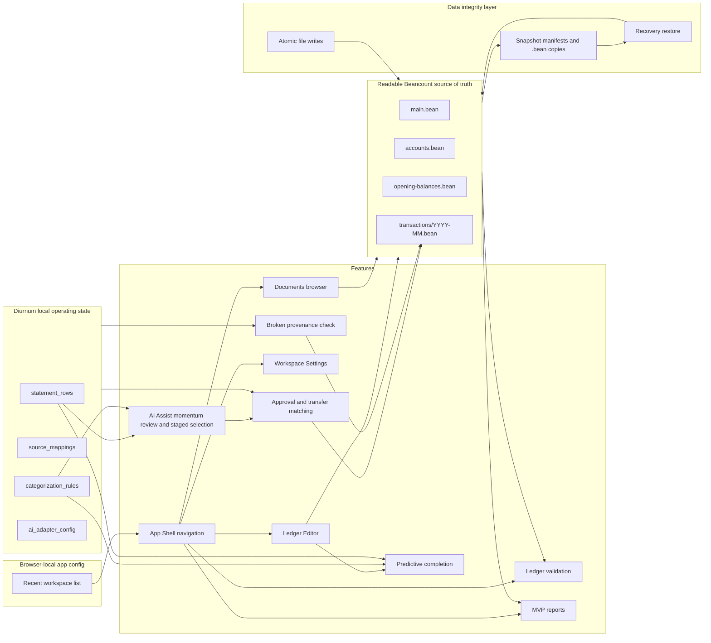
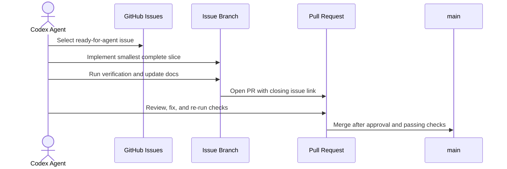

# Diurnum Architecture

Diurnum is a local-first desktop bookkeeping app. The diagrams below keep the human view small and readable while the surrounding tables preserve implementation detail for agents.

## Human-Readable System Map

## Workspace Session

The open Workspace is owned by a single React-free store,
`createWorkspaceSession` (`src/lib/workspace/session.ts`). It holds all derived
Workspace data — Suggested Entries, broken provenance, Categorization Rules,
Source Accounts, snapshots, git status — and the one invariant that this data is
refreshed as a unit after any change. `App.tsx` subscribes via
`useSyncExternalStore` and keeps only UI/navigation state.

Each mutation command returns a single `WorkspaceView` (assembled by
`workspace::view` in the Rust core and also available via `get_workspace_view`),
so a change costs one round-trip plus the mutation rather than a per-slice
read fan-out. Reports stay on-demand (cleared during Invalid Ledger State) and
AI adapter detection stays an open-time scan, so neither rides the view.
AI Assist lifecycle, approval, history, and revert operations cross this boundary
through eight dedicated Tauri commands and test-API-first TypeScript wrappers.
Batch approval and revert return a refreshed `WorkspaceView`, which the session
applies atomically through the same `applyView` path as per-row approval.
Before AI Assist review mode renders, the pure `buildAiAssistGroups` frontend
transformation filters suggestions to still-pending rows, partitions attention
items, and groups suggested rows with matching proposed rules by ledger account.
`AiAssistReview` owns only the momentum-flow UI state (current/reviewed/skipped
steps plus row and rule inclusion). Its signing boundary emits the exact staged
entry/rule selection to the session-owned batch approval command; it never writes
the ledger directly. Group-step state uses stable ledger-account keys while a pass
is running, and the stateful review surface is keyed by pass id so no staged choice
can cross into a later pass.

## Product Runtime Flow

## Data Ownership Map

## Agent Issue Workflow

## Agent Detail Index

The simplified diagrams intentionally group files by responsibility. Use this index when an implementation task needs exact file paths.

| Area                 | Primary files                                                                                                                                                                | Responsibility                                                                                                                                                                                                 |
| -------------------- | ---------------------------------------------------------------------------------------------------------------------------------------------------------------------------- | -------------------------------------------------------------------------------------------------------------------------------------------------------------------------------------------------------------- |
| Public marketing site | `docs/index.html`, `docs/images/*`, `docs/screenshots/*`                                                                                                                     | Static GitHub Pages homepage for people evaluating Diurnum, explaining the plain-text accounting position, anti-lock-in stance, workflow, product screenshot, comparison frame, and waitlist form. |
| React shell          | `src/App.tsx`, `src/components/AppShell.tsx`                                                                                                                                 | App composition, no-workspace Welcome flow, two-column Workspace shell, Ledger Editor home routing, active screen state, Workspace Switcher recents, conditional Git nav, command palette shortcuts, non-blocking GitHub Release update notice, Close Workspace, and shared status bar. |
| Workspace UI         | `src/features/workspace/*`                                                                                                                                                   | Welcome/create/open screens, New Workspace template selection, CodeMirror Ledger Editor, Documents browser, command palette, shell-hosted MVP panels for ledger details, source-account setup, CSV import, AI adapter configuration, Settings, suggested-entry review, categorization rules, Git history, MVP reports, and broken-provenance display. |
| Frontend boundary    | `src/lib/workspace/api.ts`, `src/lib/workspace/types.ts`                                                                                                                     | Typed calls from React into native Tauri workspace commands.                                                                                                                                                   |
| Tauri bridge         | `src-tauri/src/commands/workspace.rs`                                                                                                                                        | Command handlers that translate frontend requests into Rust workspace operations.                                                                                                                              |
| Rust workspace core  | `src-tauri/src/workspace/create.rs`, `open.rs`, `validation.rs`, `data_integrity.rs`, `documents.rs`, `ledger_editor.rs`, `shell.rs`, `git.rs`, `source_accounts.rs`, `imports.rs`, `approval.rs`, `ai_adapter.rs`, `categorization_rules.rs`, `reports.rs`, `settings.rs` | Domain operations for workspace lifecycle, validation, atomic file writes, Documents folder browsing and previews, Ledger Editor file/session/completion state, snapshots, restore, App Shell path/git inspection, Git history and commit actions, source accounts, CSV staging, approval, AI suggestions, rules, transfer matching, provenance, workspace metadata, Git identity, source mapping management, and MVP reporting. |
| Core support         | `src-tauri/src/workspace/beancount.rs`, `paths.rs`, `types.rs`, `errors.rs`                                                                                                  | Beancount rendering/parsing helpers, workspace paths, shared DTOs, and error handling.                                                                                                                         |
| Golden path test     | `src-tauri/src/workspace/golden_path_validation.rs`                                                                                                                          | End-to-end native workflow coverage from workspace creation through CSV import, approval, transfer approval, validation, provenance checks, invalid-ledger blocking, and MVP reports.                          |
| Local agent workflow | `.agents/skills/work-ready-issues/SKILL.md`                                                                                                                                  | Sequential ready-for-agent issue selection, branch work, review, PR, merge, and continuation workflow.                                                                                                         |

## Runtime Boundaries

- React owns presentation state, forms, error rendering, the V1 App Shell, active Workspace screen selection, and shell-hosted Workspace panels.
- `src/lib/workspace/api.ts` is the frontend boundary to native Workspace commands.
- Tauri commands translate frontend calls into Rust domain operations.
- `src-tauri/src/workspace/` owns Workspace filesystem layout, manifest handling, Beancount rendering, SQLite initialization, path validation, App Shell path/git inspection, atomic `.bean` writes, backup snapshots, snapshot restore, Source Account ledger writes, CSV import staging, Source Mapping persistence, approval, AI adapter invocation, categorization rules, transfer matching, broken-provenance checks, MVP reporting, and structural ledger validation with file-aware error messages.
- The Workspace folder owns all accounting data needed for this slice. No Diurnum cloud account is required.
- The Workspace git repository, when present, stays fully local. V1 only reads history, diffs, and working-tree state, then stages and commits locally; it does not push, pull, branch, or merge.
- The Welcome Screen is the no-Workspace surface. It is shown on first launch, after Close Workspace, and whenever no Workspace is open. Welcome/create/open screens remain outside the two-column shell.
- The New Workspace flow can be entered from Welcome as a blank Workspace with no template selected or with the example template preselected. The current create command still creates the same App-Created Workspace layout; template-specific seed data is a later backend extension.
- The Workspace Switcher stores up to 10 recent Workspaces in browser-local app config via `localStorage`, keyed by absolute Workspace path. Recent records are not written into ledger files or Workspace SQLite state.
- The Welcome Screen reuses the same app-level recents source, showing up to 5 recent Workspaces below the three primary start actions.
- The App Shell asks native helpers to inspect recent Workspace path existence and current Workspace Git state. Missing recent paths are disabled in the switcher until removed, and the Git nav item appears only when the current Workspace is inside a Git work tree.
- The App Shell exposes a global command palette in Workspace mode. `Cmd+K`/`Ctrl+K` opens it from any shell screen, it stays inert on the Welcome Screen, and it routes navigation, workspace actions, file opening, validation, and Git-aware commands through the current shell state.
- The App checks GitHub Releases for updates on launch when the update preference is enabled. It surfaces any newer release as a dismissible banner with a link out to the release page and leaves the workspace usable regardless of update state.
- The Git panel is a shell-native surface backed by Rust helpers that read the working tree, recent commit list, and commit diffs, and it stages either custom selected files or the current non-`.diurnum/` workspace edits for commit.
- The App Shell now routes the Settings screen to a dedicated shell-native surface that reads workspace metadata, source-account summaries, source mappings, detected AI adapters, git identity, snapshots, and privacy preferences from the same local workspace state used by the rest of the app.
- The shared status bar is scoped to the main pane and combines active screen context, Ledger Validation state, and Git dirty-state context when Git is available.
- The Ledger Editor is the Workspace home screen. It opens `main.bean` by default, restores saved tabs/cursor/scroll from `.diurnum/workspace.json`, and can open `.bean` files from the tree, command palette, or include directives.
- The Documents screen is a native-backed browser over the Workspace `documents/` tree. It lists source-account folders and custom folders, shows file metadata, accepts drag/drop file imports into the selected folder, and returns preview bytes or text for supported inline formats.
- Predictive Entry Completion is requested from the Ledger Editor when the cursor is at the end of a valid `YYYY-MM-DD ` date-trigger line. The Rust workspace core returns only insert text whose accounts exist in the Workspace chart of accounts.
- Predictive Entry Completion source priority is Categorization Rules, approved entry history, then BYO AI Adapter. Rule completions may omit amounts; history completions reuse approved Statement Row amounts and approved ledger postings; adapter completions require structured `sourceAccount`, `sourceAmount`, and `ledgerAccount` fields before any amount is inserted.
- Accepted predictive completions only enter the editor buffer. Persistence still depends on the existing autosave, Data Integrity atomic write path, and Ledger Validation.
- Readable Beancount files are the source of truth for ledger validation and MVP Reports.
- Diurnum-managed SQLite state stores CSV staging rows, Source Mappings, Categorization Rules, BYO AI Adapter configuration, approval provenance, placeholders, and cache state.
- The current implementation stores Diurnum-managed local data under `.diurnum/`; V1 product docs target `.ledgerly/`. Until the manifest/storage migration lands, the Data Integrity layer stores snapshots under `.diurnum/snapshots/`, the Ledger Editor stores session state in `.diurnum/workspace.json`, and Workspace `.gitignore` reserves `.ledgerly/snapshots/` for forward compatibility.
- The Data Integrity layer writes `.bean` file changes with a write-temp, fsync, rename sequence. Current Source Account writes, Approval writes, transfer Approval writes, and the Ledger Editor save command go through this boundary. Ledger Editor saves include the last-read file modification time so external edits produce a reload prompt instead of a silent overwrite.
- Git metadata helpers ensure the Workspace `.gitignore` covers `.diurnum/*`, the workspace manifest exception, and snapshots before any Git status or Git panel flow runs.
- Ledger Editor validation uses the same native structural validation as the rest of the app, with file-aware diagnostics rendered in the CodeMirror gutter and shared status bar.
- Approval creates a Snapshot before mutating `main.bean` or Monthly Transaction Files. Valid Workspace open creates one daily Snapshot at most, and restore creates a pre-restore Snapshot before replacing current `.bean` contents and rerunning Ledger Validation.
- AI Assist batch approval validates after ledger writes, then creates rules, Statement Row mappings, the durable batch record, and pass status in one SQLite transaction. Any validation or pre-commit operational failure restores the ledger Snapshot, removes Monthly Transaction Files created by that attempt, and lets the SQLite transaction roll back without partial rules or batch state.
- AI Assist batch history can drive a revert from the durable Statement Row, Diurnum entry id, ledger-file, and created-rule mappings. Revert snapshots first, removes only transaction blocks whose `diurnum_entry_id` belongs to the batch, then restores mapped Statement Rows to pending with cleared ledger provenance and deletes batch-created rules plus the history record in one SQLite transaction. Any ledger rewrite or pre-commit SQLite failure restores the snapshot; a compensation failure is reported alongside the original failure. After success, revert attempts the exact `AI Assist: reverted batch` Git commit without making commit failure fatal.
- Workspace `.gitignore` excludes `.diurnum/*` while explicitly keeping `workspace.json` committable, and it also excludes snapshot folders; Beancount files, Workspace metadata, and `documents/` remain committable.
- The Workspace overview renders Invalid Ledger State details from `WorkspaceSummary.ledgerValidation` and blocks unsafe Approval and MVP Report affordances while validation is invalid.
- The Workspace overview currently exposes recent Snapshots and restore actions, and shows them as a recovery affordance when opening a Workspace in Invalid Ledger State. The full V1 Settings navigation will host the same Snapshot surface when issue #41 lands.
- Source Account setup appends valid Beancount directives to the readable ledger files rather than storing canonical account setup only in SQLite.
- Settings owns the editable workspace metadata, source-account rename/close/opening-balance flows, source-mapping edits, AI adapter configuration, git identity, snapshot restore actions, and privacy toggles while still reusing the same underlying workspace data.
- Adding a Source Account also creates a matching slugged subfolder under `documents/`. CSV Import copies the original CSV into that folder with a date-prefixed filename so the import artifact stays committable with the Workspace.
- CSV Import now runs a native analysis pass before import, infers likely source mappings from headers and sample rows, and shows a preview of importable rows, likely duplicates, and blocked reasons when a file cannot be imported as-is.
- CSV Import stores normalized Statement Rows in SQLite Staging Area tables without writing to Beancount and persists the selected source mapping for future imports.
- Import deduplication is scoped to `(source_account, import_fingerprint)` and skips duplicates even when prior rows are already accounted.
- Imported statement rows carry a `pending_at_import` flag so approval metadata can distinguish rows that were still awaiting review when they entered the staging area.
- Suggested Entry review reads pending Statement Rows, previews the Beancount entry, exposes Journal Detail, and approves non-transfer entries into Monthly Transaction Files.
- The Inbox is the shell-native review surface for pending Statement Rows. It uses a full-height split layout with header, filters, and grouped rows in the left work area plus a flush right-hand inspector, highlights rows marked `pending_at_import`, and returns to the Ledger Editor after approval with the newly written monthly file opened.
- After approving a Suggested Entry or Transfer Match, the UI returns to the Ledger Editor and requests the monthly transaction file that received the new Beancount entry.
- Categorization Rules are user-confirmed SQLite records scoped to Source Account by default, visible/editable in the Workspace overview, and used to prefill future Standard Suggested Entries before any AI suggestion layer.
- Categorization Rules can now be edited, disabled, re-enabled, or deleted from the shell-native Settings surface, while predictive completion only considers enabled rules.
- BYO AI Adapter configuration is optional SQLite state. When configured, Diurnum sends Curated Ledger Context over stdin to the local adapter command and reads a structured AI Suggestion from stdout. Predictive completion treats the adapter as a final fallback and only uses structured source-account/source-amount fields for completion amounts.
- Curated Ledger Context includes the Statement Row, Source Account, chart of accounts, Categorization Rules, similar approved entries, and business profile. It does not grant direct Workspace file access to the adapter.
- AI Suggestions can prefill review fields and expose confidence/explanation, but they never write to Beancount; Approval remains required.
- Transfer Matches are suggested from opposite-signed same-date Statement Rows across different Source Accounts, never auto-approved, and approved as one balanced Beancount Transfer Entry that marks both linked Statement Rows accounted.
- One-sided transfer hints can appear when a Statement Row description looks like a transfer or payment, but they do not claim another row or write an approval without a linked match.
- Approval retains each source Statement Row as accounted in the Staging Area, stores the Diurnum entry id and ledger file path in SQLite, and writes minimal Beancount metadata for `Diurnum_entry_id`, `import_fingerprint`, `source_account`, and `source_file_name`.
- Broken Provenance is surfaced separately from structural Ledger Validation by scanning accounted Statement Rows against Diurnum Entry Metadata in the readable ledger files.
- MVP Reports are derived from the readable Beancount ledger files, not from unapproved SQLite Staging Area rows. Reports currently parse Diurnum-written opening balances and included Monthly Transaction Files to render Income Statement, Expense Breakdown, Source Account Balances, and a basic Balance Sheet.
- `.agents/skills/work-ready-issues/` owns the local AFK workflow for sequentially selecting, implementing, reviewing, merging, and continuing through GitHub issues labeled `ready-for-agent`.

## Current Constraints

- Only App-Created Workspaces are supported.
- `USD` is the only supported MVP currency.
- Validation is structural and local. It runs after Diurnum creates a Workspace, when opening a Workspace, and when the UI rechecks the ledger after External Ledger Edits.
- The UI includes editable path fields so Workspace create/open works even when native directory picker support is unavailable in development.
- CSV Imports are tied to one Source Account. Imported Statement Rows live in SQLite Staging Area tables and do not mutate the Beancount ledger.
- Approval is blocked during Invalid Ledger State. Approved non-transfer entries write to `transactions/YYYY-MM.bean`, include a Source Account posting plus a balancing Ledger Account posting, and mark the Statement Row accounted in the Staging Area.
- Approved transfers write one transaction between the two Source Accounts and mark both linked Statement Rows accounted with the same Diurnum entry id and ledger file path.
- MVP Reports are blocked during Invalid Ledger State and cover Diurnum-written `.bean` syntax for the MVP reporting surface rather than arbitrary Beancount.
- Raw CSV row details, AI explanations, and confidence scores remain in Diurnum-managed local data or transient review state and are not written as Beancount metadata.
- Tauri npm packages and Rust crates are pinned to the same `2.0.x` minor line to avoid dev-time version mismatch errors.
- Native Tauri dialog/opener plugin integration remains a future compatibility task.
