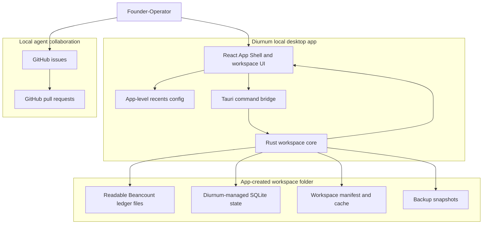
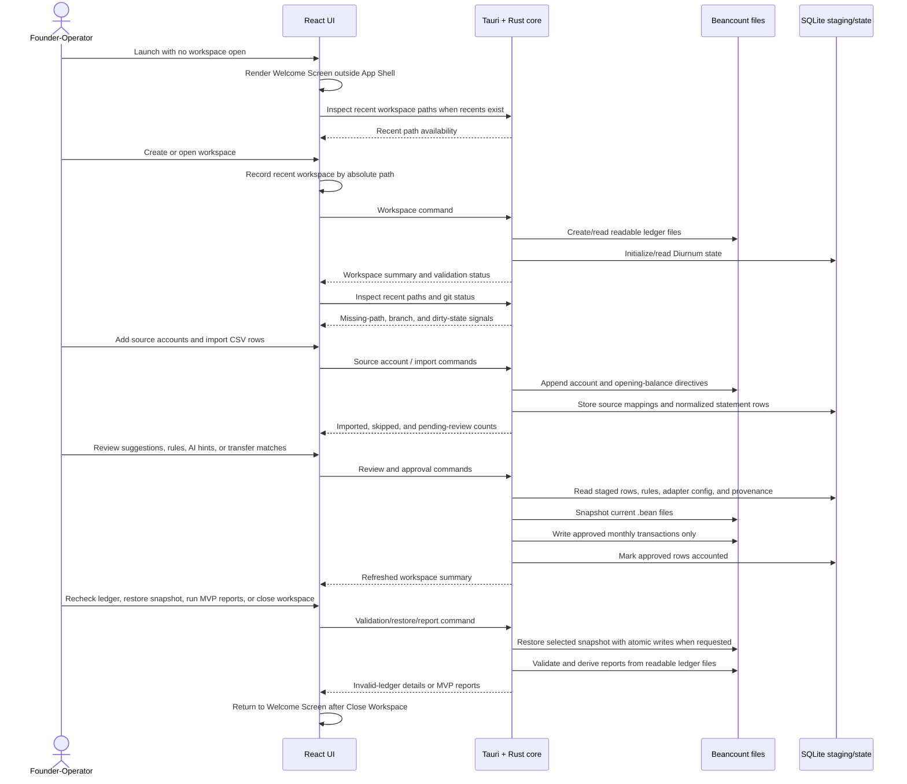
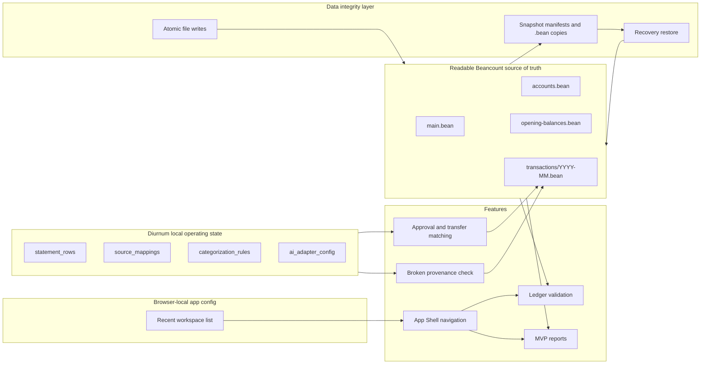
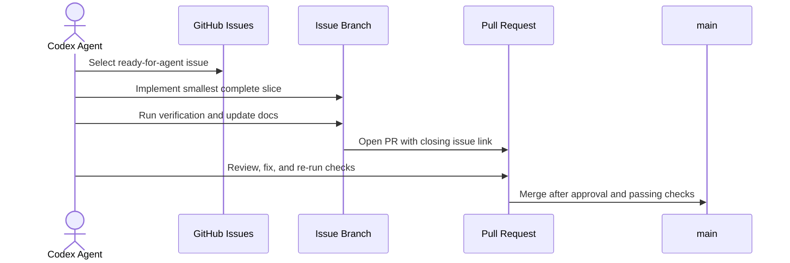

# Diurnum Architecture

Diurnum is a local-first desktop bookkeeping app. The diagrams below keep the human view small and readable while the surrounding tables preserve implementation detail for agents.

## Human-Readable System Map

## Product Runtime Flow

## Data Ownership Map

## Agent Issue Workflow

## Agent Detail Index

The simplified diagrams intentionally group files by responsibility. Use this index when an implementation task needs exact file paths.

| Area                 | Primary files                                                                                                                                                                | Responsibility                                                                                                                                                                                                 |
| -------------------- | ---------------------------------------------------------------------------------------------------------------------------------------------------------------------------- | -------------------------------------------------------------------------------------------------------------------------------------------------------------------------------------------------------------- |
| React shell          | `src/App.tsx`, `src/components/AppShell.tsx`                                                                                                                                 | App composition, no-workspace Welcome flow, two-column Workspace shell, active screen state, Workspace Switcher recents, conditional Git nav, Close Workspace, and shared status bar.                           |
| Workspace UI         | `src/features/workspace/*`                                                                                                                                                   | Welcome/create/open screens, New Workspace template selection, and shell-hosted MVP panels for ledger details, source-account setup, CSV import, AI adapter configuration, suggested-entry review, categorization rules, MVP reports, and broken-provenance display. |
| Frontend boundary    | `src/lib/workspace/api.ts`, `src/lib/workspace/types.ts`                                                                                                                     | Typed calls from React into native Tauri workspace commands.                                                                                                                                                   |
| Tauri bridge         | `src-tauri/src/commands/workspace.rs`                                                                                                                                        | Command handlers that translate frontend requests into Rust workspace operations.                                                                                                                              |
| Rust workspace core  | `src-tauri/src/workspace/create.rs`, `open.rs`, `validation.rs`, `data_integrity.rs`, `shell.rs`, `source_accounts.rs`, `imports.rs`, `approval.rs`, `ai_adapter.rs`, `categorization_rules.rs`, `reports.rs` | Domain operations for workspace lifecycle, validation, atomic file writes, snapshots, restore, App Shell path/git inspection, source accounts, CSV staging, approval, AI suggestions, rules, transfer matching, provenance, and MVP reporting. |
| Core support         | `src-tauri/src/workspace/beancount.rs`, `paths.rs`, `types.rs`, `errors.rs`                                                                                                  | Beancount rendering/parsing helpers, workspace paths, shared DTOs, and error handling.                                                                                                                         |
| Golden path test     | `src-tauri/src/workspace/golden_path_validation.rs`                                                                                                                          | End-to-end native workflow coverage from workspace creation through CSV import, approval, transfer approval, validation, provenance checks, invalid-ledger blocking, and MVP reports.                          |
| Local agent workflow | `.agents/skills/work-ready-issues/SKILL.md`                                                                                                                                  | Sequential ready-for-agent issue selection, branch work, review, PR, merge, and continuation workflow.                                                                                                         |

## Runtime Boundaries

- React owns presentation state, forms, error rendering, the V1 App Shell, active Workspace screen selection, and shell-hosted Workspace panels.
- `src/lib/workspace/api.ts` is the frontend boundary to native Workspace commands.
- Tauri commands translate frontend calls into Rust domain operations.
- `src-tauri/src/workspace/` owns Workspace filesystem layout, manifest handling, Beancount rendering, SQLite initialization, path validation, App Shell path/git inspection, atomic `.bean` writes, backup snapshots, snapshot restore, Source Account ledger writes, CSV import staging, Source Mapping persistence, approval, AI adapter invocation, categorization rules, transfer matching, broken-provenance checks, MVP reporting, and structural ledger validation with file-aware error messages.
- The Workspace folder owns all accounting data needed for this slice. No Diurnum cloud account is required.
- The Welcome Screen is the no-Workspace surface. It is shown on first launch, after Close Workspace, and whenever no Workspace is open. Welcome/create/open screens remain outside the two-column shell.
- The New Workspace flow can be entered from Welcome as a blank Workspace with no template selected or with the example template preselected. The current create command still creates the same App-Created Workspace layout; template-specific seed data is a later backend extension.
- The Workspace Switcher stores up to 10 recent Workspaces in browser-local app config via `localStorage`, keyed by absolute Workspace path. Recent records are not written into ledger files or Workspace SQLite state.
- The Welcome Screen reuses the same app-level recents source, showing up to 5 recent Workspaces below the three primary start actions.
- The App Shell asks native helpers to inspect recent Workspace path existence and current Workspace Git state. Missing recent paths are disabled in the switcher until removed, and the Git nav item appears only when the current Workspace is inside a Git work tree.
- The shared status bar is scoped to the main pane and combines active screen context, Ledger Validation state, and Git dirty-state context when Git is available.
- Readable Beancount files are the source of truth for ledger validation and MVP Reports.
- Diurnum-managed SQLite state stores CSV staging rows, Source Mappings, Categorization Rules, BYO AI Adapter configuration, approval provenance, placeholders, and cache state.
- The current implementation stores Diurnum-managed local data under `.diurnum/`; V1 product docs target `.ledgerly/`. Until the manifest/storage migration lands, the Data Integrity layer stores snapshots under `.diurnum/snapshots/` and also reserves `.ledgerly/snapshots/` in Workspace `.gitignore` for forward compatibility.
- The Data Integrity layer writes `.bean` file changes with a write-temp, fsync, rename sequence. Current Source Account writes, Approval writes, transfer Approval writes, and the Ledger Editor save command go through this boundary.
- Approval creates a Snapshot before mutating `main.bean` or Monthly Transaction Files. Valid Workspace open creates one daily Snapshot at most, and restore creates a pre-restore Snapshot before replacing current `.bean` contents and rerunning Ledger Validation.
- Workspace `.gitignore` excludes snapshot folders only; Beancount files, Workspace metadata, and `documents/` remain committable.
- The Workspace overview renders Invalid Ledger State details from `WorkspaceSummary.ledgerValidation` and blocks unsafe Approval and MVP Report affordances while validation is invalid.
- The Workspace overview currently exposes recent Snapshots and restore actions, and shows them as a recovery affordance when opening a Workspace in Invalid Ledger State. The full V1 Settings navigation will host the same Snapshot surface when issue #41 lands.
- Source Account setup appends valid Beancount directives to the readable ledger files rather than storing canonical account setup only in SQLite.
- CSV Import stores normalized Statement Rows in SQLite Staging Area tables without writing to Beancount.
- Import deduplication is scoped to `(source_account, import_fingerprint)` and skips duplicates even when prior rows are already accounted.
- Suggested Entry review reads pending Statement Rows, previews the Beancount entry, exposes Journal Detail, and approves non-transfer entries into Monthly Transaction Files.
- Categorization Rules are user-confirmed SQLite records scoped to Source Account by default, visible/editable in the Workspace overview, and used to prefill future Standard Suggested Entries before any AI suggestion layer.
- BYO AI Adapter configuration is optional SQLite state. When configured, Diurnum sends Curated Ledger Context over stdin to the local adapter command and reads a structured AI Suggestion from stdout.
- Curated Ledger Context includes the Statement Row, Source Account, chart of accounts, Categorization Rules, similar approved entries, and business profile. It does not grant direct Workspace file access to the adapter.
- AI Suggestions can prefill review fields and expose confidence/explanation, but they never write to Beancount; Approval remains required.
- Transfer Matches are suggested from opposite-signed same-date Statement Rows across different Source Accounts, never auto-approved, and approved as one balanced Beancount Transfer Entry that marks both linked Statement Rows accounted.
- One-sided transfer hints can appear when a Statement Row description looks like a transfer or payment, but they do not claim another row or write an approval without a linked match.
- Approval retains each source Statement Row as accounted in the Staging Area, stores the Diurnum entry id and ledger file path in SQLite, and writes minimal Beancount metadata for `Diurnum_entry_id`, `import_fingerprint`, `source_account`, and `source_file_name`.
- Broken Provenance is surfaced separately from structural Ledger Validation by scanning accounted Statement Rows against Diurnum Entry Metadata in the readable ledger files.
- MVP Reports are derived from the readable Beancount ledger files, not from unapproved SQLite Staging Area rows. Reports currently parse Diurnum-written opening balances and included Monthly Transaction Files to render Income Statement, Expense Breakdown, Source Account Balances, and a basic Balance Sheet.
- `.agents/skills/work-ready-issues/` owns the local AFK workflow for sequentially selecting, implementing, reviewing, merging, and continuing through GitHub issues labeled `ready-for-agent`.

## Current Constraints

- Only App-Created Workspaces are supported.
- `USD` is the only supported MVP currency.
- Validation is structural and local. It runs after Diurnum creates a Workspace, when opening a Workspace, and when the UI rechecks the ledger after External Ledger Edits.
- The UI includes editable path fields so Workspace create/open works even when native directory picker support is unavailable in development.
- CSV Imports are tied to one Source Account. Imported Statement Rows live in SQLite Staging Area tables and do not mutate the Beancount ledger.
- Approval is blocked during Invalid Ledger State. Approved non-transfer entries write to `transactions/YYYY-MM.bean`, include a Source Account posting plus a balancing Ledger Account posting, and mark the Statement Row accounted in the Staging Area.
- Approved transfers write one transaction between the two Source Accounts and mark both linked Statement Rows accounted with the same Diurnum entry id and ledger file path.
- MVP Reports are blocked during Invalid Ledger State and cover Diurnum-written `.bean` syntax for the MVP reporting surface rather than arbitrary Beancount.
- Raw CSV row details, AI explanations, and confidence scores remain in Diurnum-managed local data or transient review state and are not written as Beancount metadata.
- Tauri npm packages and Rust crates are pinned to the same `2.0.x` minor line to avoid dev-time version mismatch errors.
- Native Tauri dialog/opener plugin integration remains a future compatibility task.
